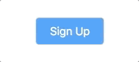

# CSS Mocks Exercise

In this exercise, your goal is to create the three design elements depicted below. You can choose your own images for the later mocks, but otherwise you should try to make the styling as close to what you see as possible. Most importantly, don't use any external CSS libraries, and no JavaScript! You should be writing all of the CSS you need yourself.

## Mock 1

## Mock 2

## Mock 3

